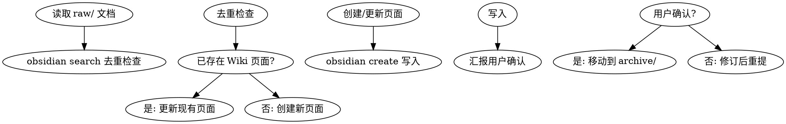

# Docs Ingest Skill

文档摄取技能：分析 raw/ 目录文档 → 创建/更新 Wiki 页面 → 用户确认后归档到 archive/

## When to Use

**触发条件：**
- 发现新文档在 raw/ 目录
- 用户要求摄取外部文档到 Wiki
- 需要将现有知识体系化

**症状：**
- 直接使用 raw 文档而不体系化
- 不检查 Wiki 是否存在重复内容

## Core Pattern



## Real Commands

使用 `obsidian` CLI (需 Obsidian 运行中):

```bash
# 去重检查 - 搜索是否已有相关页面
obsidian search query="相关关键词" limit=5

# 创建新 Wiki 页面
obsidian create name="category/slug" content="# Title\n\nContent" silent

# 追加内容到现有页面
obsidian append file="ExistingNote" content="\n\n## New Section"

# 读取现有页面检查是否需要更新
obsidian read file="ExistingNote"
```

### create 命令参数

```bash
obsidian create name="Note Name" content="Content here" silent overwrite
```

| 参数 | 说明 |
|------|------|
| `name` | 笔记名称（不含路径/扩展名） |
| `content` | 笔记内容（使用 `\n` 换行） |
| `silent` | 不自动打开文件 |
| `overwrite` | 覆盖已存在文件 |
| `template` | 指定模板名称 |

## Quick Reference

| 阶段 | 操作 | 命令 |
|------|------|------|
| 分析 | 读取 raw/ 文档 | `Read` tool |
| 去重 | 搜索 Wiki | `obsidian search query="去重检查"` |
| 创建 | 创建页面 | `obsidian create name="..." content="..." silent` |
| 归档 | 移动到 archive/ | `Bash mv` |

## Implementation Steps

1. **Analyze**: 读取 raw/ 文档，分析结构和内容
2. **Deduplicate**: `obsidian search` 检查 Wiki 是否存在相关内容
3. **Create**: `obsidian create name="..." content="..." silent` 创建/更新 Wiki 页面
4. **Report**: 汇报摄取结果给用户（新增/更新/待处理）
5. **Archive**: 用户确认后，`mv` 源文件到 archive/

## Frontmatter 模板

```yaml
---
name: {category}/{slug}
description: 一句话描述
type: concept | entity | source | synthesis | guide
tags: [{tags}]
created: {date}
updated: {date}
source: ../../archive/{category}/{filename}.md
---
```

### Frontmatter 字段说明

| 字段 | 必需 | 说明 |
|------|------|------|
| `name` | ✅ | 页面 slug，格式 `{category}/{slug}` |
| `description` | ✅ | 一句话描述 |
| `type` | ✅ | `concept`, `entity`, `source`, `synthesis`, `guide` |
| `tags` | ✅ | 标签数组 |
| `created` | ✅ | 创建日期 `YYYY-MM-DD` |
| `updated` | ✅ | 更新日期 `YYYY-MM-DD` |
| `source` | 建议 | 原始文件路径 `../../archive/...` |

## Common Mistakes

| 错误 | 正确做法 |
|------|----------|
| 不检查重复直接创建 | 先 `obsidian search` 去重 |
| 跳过用户确认 | 必须汇报并等待确认 |
| 不添加 source 字段 | 归档后添加源文件路径 |

## Real-World Impact

- 知识一致性提升
- Wiki 持续生长
- 避免重复内容