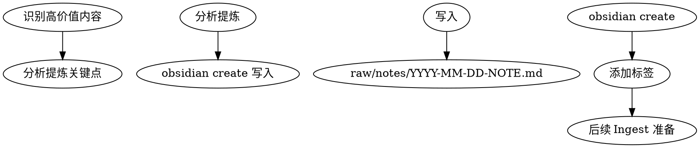

# Inspool Skill

## Overview
会话知识沉淀技能：将高价值回答、阶段性结果、经验教训总结到 raw/notes/ 目录

## Layered Architecture

```
obsidian-skills (底层)  →  Wiki skills (编排层)
├── obsidian-cli        →  inspool 使用 create
├── obsidian-markdown   →  格式规范
└── obsidian-bases      →  可选：知识库视图
```

## When to Use

**触发条件：**
- 完成复杂问题解答
- 发现新的 Claude Code 使用模式
- 积累实用技巧或经验
- 会话结束前的知识沉淀

**症状：**
- 重要发现未记录
- 重复解决问题
- 知识随会话消失

## Core Pattern



## Real Commands

使用 `obsidian` CLI (需 Obsidian 运行中):

```bash
# 创建会话笔记
obsidian create name="notes/2024-01-15-claude-config" content="..." silent

# 追加内容到现有笔记
obsidian append file="notes/2024-01-15-claude-config" content="\n\n## 新发现"

# 读取笔记检查
obsidian read file="notes/2024-01-15-claude-config"
```

### create 命令参数

```bash
obsidian create name="Note Name" content="Content" silent overwrite
```

| 参数 | 说明 |
|------|------|
| `name` | 笔记名称 |
| `content` | 笔记内容（使用 `\n` 换行） |
| `silent` | 不自动打开文件 |
| `overwrite` | 覆盖已存在文件 |

## Quick Reference

| 阶段 | 操作 | 命令 |
|------|------|------|
| Identify | 分析对话 | 识别高价值内容 |
| Extract | 提炼要点 | 提取关键信息 |
| Write | 创建笔记 | `obsidian create name="..." content="..." silent` |
| Tag | 添加 frontmatter | 标记类型和来源 |

## Note 模板

```markdown
---
name: notes/YYYY-MM-DD-{topic}
description: 一句话描述
type: insight | pattern | tip | lesson
tags: [session, {relevant-tags}]
created: {date}
source: conversation
---

# {Topic}

## 关键发现
- 要点 1
- 要点 2

## 上下文
{相关背景}

## 应用场景
{何时使用}

## 相关 Wiki 页面
- [[existing-page]]（如果已有）
```

## When to Use - Decision Tree

```
应该 inspool?
├── 解决方案复杂度 > 5 分钟? → 是 → ✅ 记录
├── 发现通用模式? → 是 → ✅ 记录
├── 错误教训值得分享? → 是 → ✅ 记录
├── 纯执行无新知? → 否 → 不记录
├── 已知信息确认? → 否 → 不记录
```

## Common Mistakes

| 错误 | 正确做法 |
|------|----------|
| 会话结束不沉淀 | 会话结束前运行 inspool |
| 记录太笼统 | 具体：问题→解决→结果 |
| 不标记类型 | 用 type 字段区分类型 |
| 不关联已有 Wiki | 检查 [[links]] 避免重复 |

## Types

| Type | 用途 | 特点 |
|------|------|------|
| insight | 新发现 | 突破性认知 |
| pattern | 通用模式 | 可复用方法 |
| tip | 实用技巧 | 小而美 |
| lesson | 经验教训 | 失败教训 |

## Real-World Impact

- 知识不再随会话消失
- 为 Wiki 持续供源
- 经验可复用
- 团队知识共享