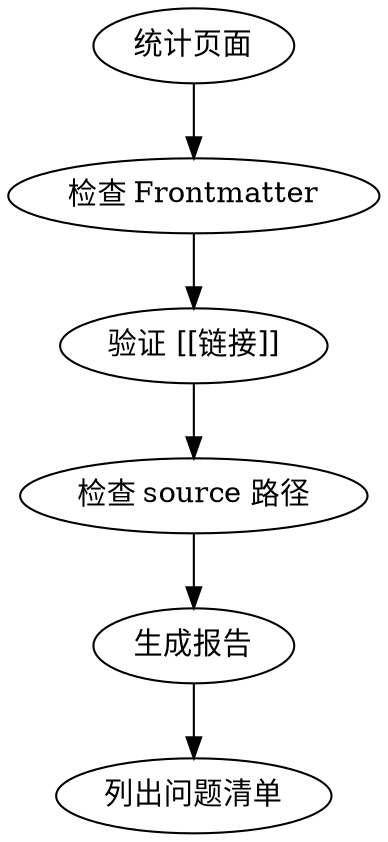

# Wiki Lint Skill

Wiki 健康检查技能：验证 frontmatter 完整性、交叉引用有效性、source 路径正确性。

## When to Use

**触发条件：**
- 定期 Wiki 维护
- 添加新页面后验证
- 发现链接失效问题
- 报告 Wiki 健康状况

**症状：**
- 链接失效未被检测
- Frontmatter 字段缺失
- Source 指向不存在的文件

## Core Pattern



## Quick Reference

| 检查项 | 方法 | 命令/工具 |
|--------|------|----------|
| Frontmatter | Grep 文件头 | `grep "^---" wiki/**/*.md` |
| 交叉引用 | Grep `[[` | `grep -r '\[\[' wiki/` |
| Source 路径 | 验证文件存在 | Bash `[ -f "$file" ]` |
| 页面列表 | 统计数量 | `obsidian search query="" limit=100` |

### 可选：使用 obsidian-cli

```bash
# 获取所有笔记列表（用于统计）
obsidian search query="" limit=100

# 检查标签使用情况
obsidian tags sort=count counts

# 查看特定页面的链接
obsidian backlinks file="some-note"
```

## Required Frontmatter Fields

```yaml
---
name: page-slug          # 必需
description: 描述         # 必需
type: category           # 必需
tags: [tag1, tag2]       # 必需
created: YYYY-MM-DD      # 必需
updated: YYYY-MM-DD      # 必需
source: ../../archive/.. # 建议添加
---
```

| 字段 | 必需 | 说明 |
|------|------|------|
| `name` | ✅ | 页面 slug |
| `description` | ✅ | 一句话描述 |
| `type` | ✅ | `concept`, `entity`, `source`, `synthesis`, `guide`, `tutorial`, `tips` |
| `tags` | ✅ | 标签数组 |
| `created` | ✅ | 创建日期 |
| `updated` | ✅ | 更新日期 |
| `source` | 建议 | 原始文件路径 |

## Lint 检查标准

### 1. Frontmatter 检查
- `name` 字段存在且非空
- `description` 字段存在
- `type` 字段在允许值内
- `created`/`updated` 格式正确

### 2. 交叉引用检查
```bash
# 查找所有 [[链接]]
grep -r '\[\[' wiki/ --include="*.md"
# 验证每个链接目标存在
```

### 3. Source 路径检查
```bash
# 验证 source 指向存在文件
grep "^source:" wiki/**/*.md | while read line; do
  file=$(echo $line | sed 's|.*source: ||')
  [ -f "$file" ] || echo "Missing: $file"
done
```

## Common Mistakes

| 错误 | 正确做法 |
|------|----------|
| 跳过 source 检查 | source 必须指向 archive/ 中文件 |
| 忽略交叉引用问题 | [[链接]] 必须对应存在页面 |
| 不记录问题清单 | 生成报告便于追踪修复 |

## Output Format

```markdown
## Wiki Lint Report

### 统计
- 总页面数: N
- 问题数: N

### 问题清单
| 级别 | 文件 | 问题 |
|------|------|------|
| 🔴 | file.md | 缺少必需字段 |
| 🟡 | file.md | [[链接]] 目标不存在 |
```

## Real-World Impact

- Wiki 质量持续监控
- 问题早发现早修复
- 维护成本降低