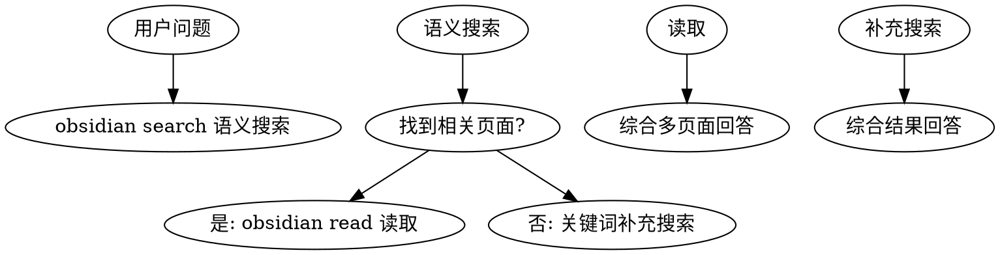

# Wiki Query Skill

基于 Wiki 回答问题的技能，遵循 Wiki-First 原则，避免重复生成摘要。

## When to Use

**触发条件：**
- 用户询问 Claude Code 功能、概念，最佳实践
- 需要查找命令用法、配置选项、技巧
- 任何需要准确信息的问题

**症状：**
- 倾向直接回答而非查询 Wiki
- 生成一次性摘要而非引用现有页面

## Core Pattern



## Real Commands

使用 `obsidian` CLI (需 Obsidian 运行中):

```bash
# 语义搜索 Wiki 页面
obsidian search query="Claude Code 配置"

# 读取具体页面内容
obsidian read file="claude-code-best-practice"

# 查看标签统计
obsidian tags sort=count counts

# 查看页面反向链接
obsidian backlinks file="some-note"
```

## Quick Reference

| 操作 | 命令 | 说明 |
|------|------|------|
| 语义搜索 | `obsidian search query="关键词"` | 搜索 Wiki 页面 |
| 读取页面 | `obsidian read file="PageName"` | 获取页面内容 |
| 标签搜索 | `obsidian tags sort=count counts` | 按频率查看标签 |
| 反向链接 | `obsidian backlinks file="PageName"` | 查看引用此页的页面 |

## Implementation

1. **查询**: `obsidian search query="语义关键词"`
2. **补充**: 关键词搜索 `obsidian search query="补充词"`
3. **读取**: `obsidian read file="PageName"` 获取关键页面
4. **综合**: 整合多个页面答案回答问题
5. **引用**: 标注来源页面链接 `[[page-slug]]`

## Wiki-First 原则

**核心规则：**
- 永远先查询 Wiki，再生成答案
- 优先引用现有页面，而非重新总结
- 使用 `[[wikilink]]` 标注来源

## Common Mistakes

| 错误 | 正确做法 |
|------|----------|
| 直接生成摘要 | 先 `obsidian search` 搜索 |
| 只用一个关键词 | 语义+关键词双重搜索 |
| 不引用来源 | 标注 `[[page-slug]]` 链接 |

## Real-World Impact

- Token 节省 30-50%
- 答案一致性提升
- Wiki 页面持续更新